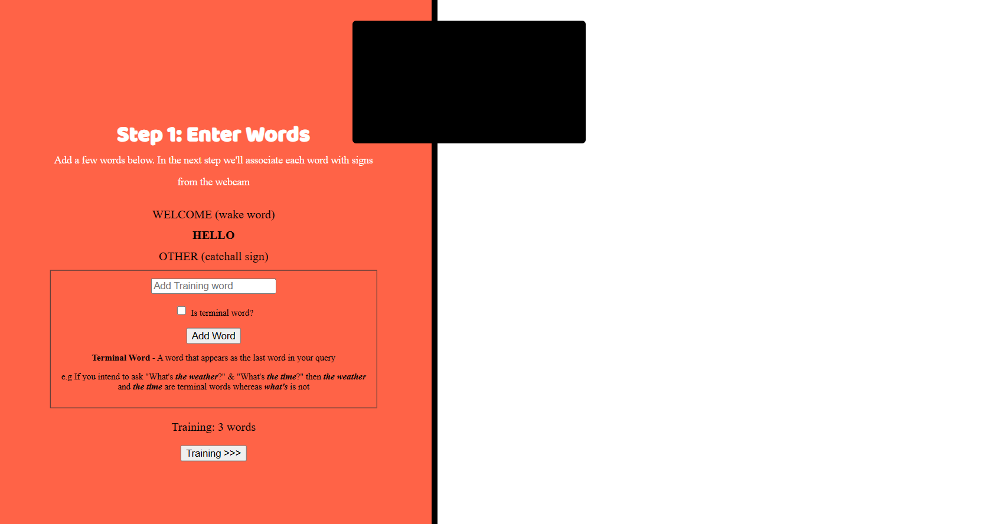
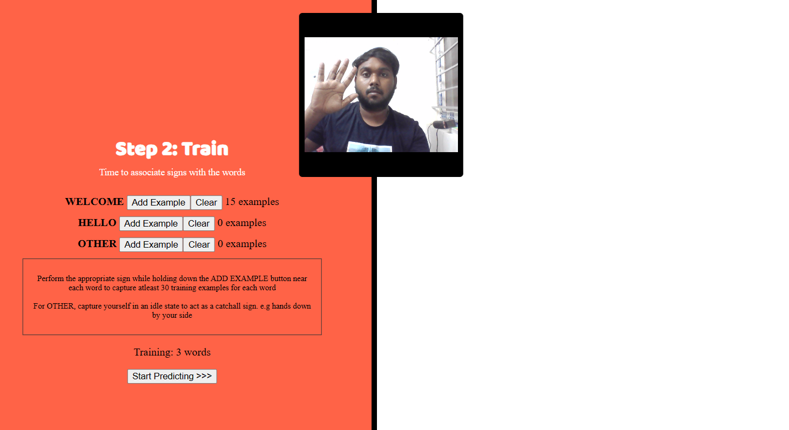

# Sign Language Translator

The Sign Language Translator is a web application that utilizes machine learning and speech recognition technologies to translate sign language gestures into text and vice versa. This application allows users to interact with their webcam to input sign language gestures, which are then recognized and translated into text. It also supports speech input for users to interact with the application using voice commands.

## Features

- **Webcam Integration**: The application captures video from the user's webcam to recognize sign language gestures.
- **Training Words**: Users can add and train the application with specific words or gestures for recognition.
- **KNN Image Classifier**: The application uses a K-Nearest Neighbors (KNN) image classifier to recognize trained gestures.
- **Text-to-Speech (TTS)**: Recognized text is converted into speech output, allowing for interactive communication.
- **Speech-to-Text (STT)**: Users can input text through spoken commands, which are recognized using speech-to-text technology.
- **User Interface**: The web interface provides clear instructions, status updates, and feedback to users.

## Getting Started

- **Step 1** : Open the terminal
- **Step 2** : Run `npm install`
- **Step 3** : Type `npm start`
- **Step 4** : Open this link in the browser ` http://localhost:9966/`

## Usage

1. **Setup**: Ensure your webcam is connected and accessible by the browser.
2. **Open Application**: Open the `index.html` file in a web browser that supports webcam access.
3. **Add Training Words**: In the "Step 1: Enter Words" section, add the words or gestures you want to train the application with.
4. **Train the Model**: Click on the "Training" button to start training the KNN model with the added words.
5. **Perform Gestures**: Perform the gestures in front of the webcam while holding down the "Add Example" button to capture training examples.
6. **Start Predicting**: Once training is complete, click on "Start Predicting" to enable gesture recognition.
7. **Interact with the Application**: Perform gestures in front of the webcam to trigger recognition. Speak voice commands to interact with the application.

## Screenshots

#### This page is the home screen

#### This is the page where we will train the model

#### This page is for live translating the sign language

https://github.com/Churanta/Sign-Language-Translator/assets/83538805/784ee842-4b84-4514-90ad-3aaa6768b350

## Dependencies

- TensorFlow.js: Used for machine learning tasks such as image classification.
- Web Speech API: Provides support for speech recognition and synthesis.
- WebRTC: Enables real-time communication with webcam access in web browsers.

## Compatibility

The Sign Language Translator web application is compatible with modern web browsers such as Google Chrome and Mozilla Firefox. Ensure that your browser supports webcam access and has JavaScript enabled.

## Limitations

- Performance may vary depending on the user's hardware and browser capabilities.
- Accuracy of gesture recognition may be affected by lighting conditions, background noise, and variations in sign language gestures.

## Sign Language Translator Training Process

The training process in the Sign Language Translator project involves setting up a KNN (K-Nearest Neighbors) image classifier, capturing webcam images, and adding those images as training examples for different classes (words or gestures). This README section explains the JavaScript code used for training in the project.

1.  Setting Up KNN Classifier

The code initializes a KNNImageClassifier instance from the `deeplearn-knn-image-classifier` library. This classifier is used to train and predict classes based on webcam images.

2.  Webcam Setup

The `startWebcam()` function sets up the webcam by accessing the user's camera using the `getUserMedia()` function from the MediaDevices API. It configures the video element to display the webcam feed.

3.  Training Initialization

When the user clicks on the "Training" button, the `startTraining()` function is called. This function starts the webcam feed and sets up the training process.

4.  Capturing Training Examples

Inside the `train()` function, which is called repeatedly, the current webcam image is captured using `dl.fromPixels(this.video)`. This image is then added as a training example for the currently selected class (word or gesture) if the user is holding down the corresponding training button.
The `addImage()` method of the KNNImageClassifier instance is used to add the captured image to the training set of the selected class. The example count for each class is updated in real-time to show the number of training examples captured for each class.

5.  Training Completion

Once the user is satisfied with the training examples, they can proceed to start predicting by clicking on the "Start Predicting" button.

6.  KNN Model Loading

Before starting the prediction process, the KNN model needs to be loaded. This is done using the `load()` method of the KNNImageClassifier instance.

7.  Prediction Start

After the model is loaded successfully, the `startPredicting()` function is called, which initiates the prediction process.

8.  Prediction Loop

Inside the `predict()` function, which is called repeatedly, the current webcam image is captured, and the KNN model predicts the class of the captured image. If a prediction above a certain confidence threshold is made and it's a new prediction (i.e., not the same as the previous prediction), it triggers an action, such as speaking the recognized word using text-to-speech.

The JavaScript code for training in the Sign Language Translator project enables users to capture webcam images as training examples for different classes and uses a KNN image classifier to perform real-time recognition of gestures or words based on the trained model. This allows for interactive translation of sign language gestures into text.

# Sign-Language-Translator
